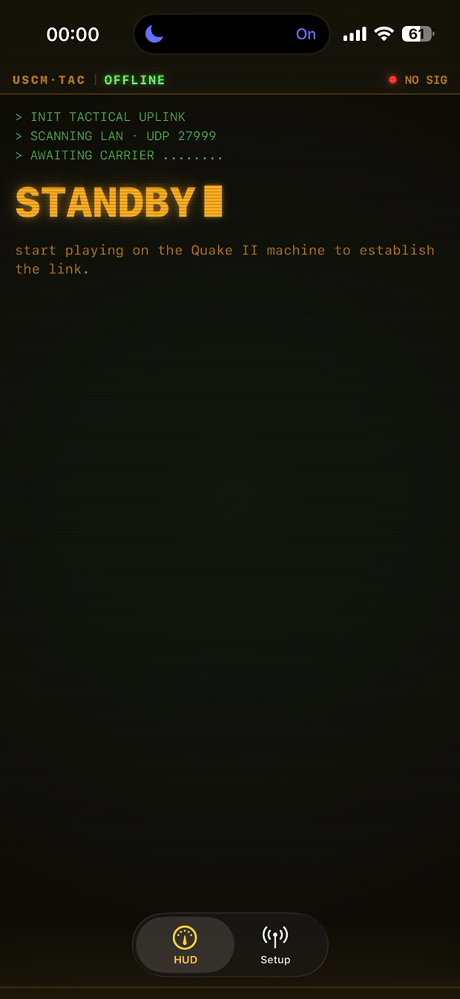
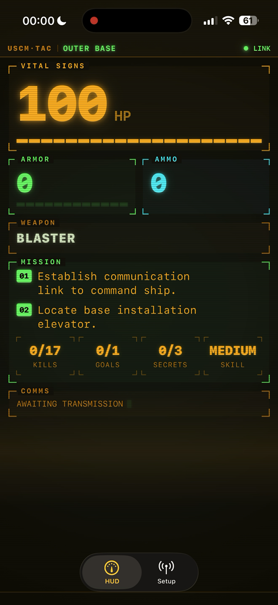
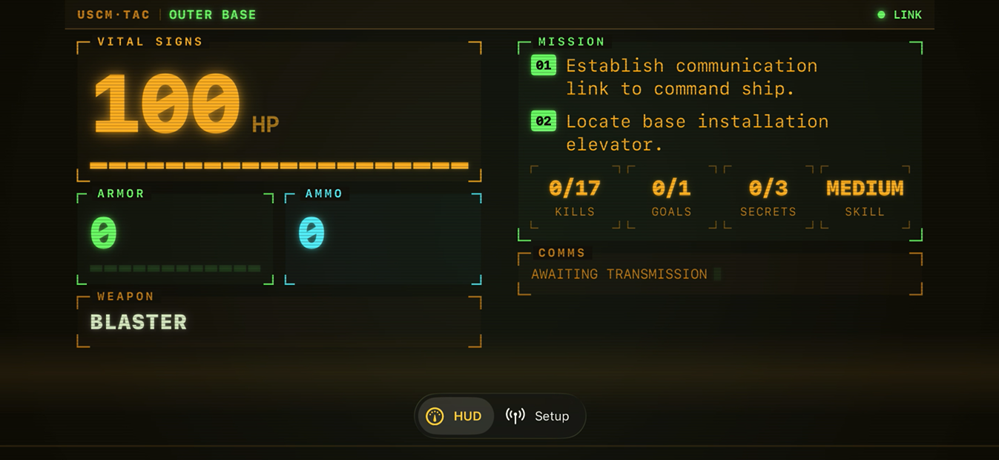
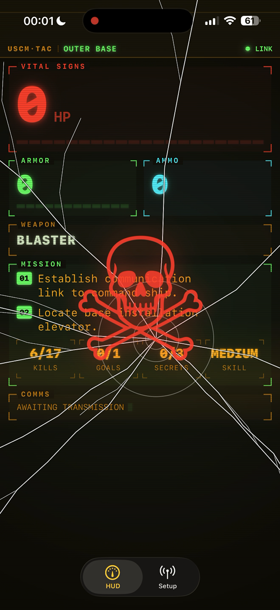

# Quake II Tactical Computer — Apple Watch companion

Turn your wrist into the Quake II marine's in-fiction **help computer**. An old
Mac running Quake II emits a live UDP feed of the player's state — health, armor,
ammo, weapon, inventory, mission objectives, damage and pickups. An iPhone app
receives it on the LAN and relays it to an Apple Watch, which renders an
amber-phosphor terminal HUD with damage haptics and in-game event sounds.

```
Old Mac (Quake II)  ──UDP/JSON──▶  iPhone (relay)  ──WatchConnectivity──▶  Apple Watch
  cl_watchlink.c                    NWListener                              Tactical Computer UI
  (off unless watch_host set)       GameState model                        haptics + sounds
```

The engine half lives in
**[old-mac-quake2](https://github.com/matthewdeaves/old-mac-quake2)** (branch
[`watch-tactical-computer`](https://github.com/matthewdeaves/old-mac-quake2/tree/watch-tactical-computer)):
a cvar-gated feed in `src/client/cl_watchlink.c`, off by default (`watch_host ""`).
The wire format is newline-delimited JSON over UDP port 27999 — JSON specifically
so the big-endian PowerPC Macs stay byte-order-proof.

## Screens

| | |
|---|---|
| **STANDBY** — scanning the LAN for the game | **Live HUD** — vitals, gauges, mission |
|  |  |

**Landscape** — the terminal re-syncs with a CRT wobble on rotation:



**Flatline** — cracked glass and a permanent kill marker until the next game:



> Screenshots pulled from an iPhone capture of a live game on the PowerPC fleet.

## Status

- ✅ **Engine feed** — shipped in
  [old-mac-quake2](https://github.com/matthewdeaves/old-mac-quake2).
- ✅ **iPhone relay** — UDP listener → `GameState` → WatchConnectivity bridge.
- ✅ **watchOS app** — Vitals / Inventory / Mission views, damage haptics,
  curated event sounds, live heart-rate, keep-awake workout session.
- 🔧 **Polish** — amber-phosphor chrome, complications, sound curation (ongoing).

## Build

Open `Quake2TacticalWatchComputer/Quake2TacticalWatchComputer.xcodeproj` in Xcode
(iOS + watchOS targets in one project) and run on a paired iPhone + Apple Watch.

To test the feed without a watch, point the game's `watch_host` cvar at your dev
machine and run `scripts/watchlink-listen.py` from the engine repo.

## Start here

[`PLAN.md`](PLAN.md) is the authoritative design doc — engine code review, full
architecture, wire format (§2), and phased delivery.

## License

The engine patch is GPLv2 (Quake II). App code in this repo: TBD.
